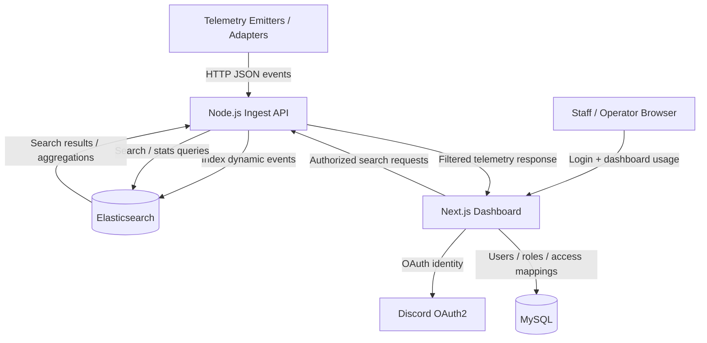

# Architecture Overview

`elastic-telemetry` is a flexible event ingest and search backend for systems that produce high-volume, semi-structured activity logs.

The core idea is simple:

> accept dynamic JSON events, index them for search, and expose categorized, permission-aware views through a dashboard.

The system is designed around three responsibilities:

1. **Ingest fast** — receive telemetry without blocking the source application.
2. **Search efficiently** — store dynamic event data in Elasticsearch instead of forcing it into rigid SQL tables.
3. **Control access safely** — keep users, permissions, and environment mappings in MySQL, then proxy dashboard queries through an authenticated backend layer.

---

## High-Level Architecture



---

## Request Flow

### 1. Event ingest

Telemetry clients send JSON payloads into the ingest API.

```txt
client / adapter
      ↓
POST /log
      ↓
Node.js ingest service
      ↓
Elasticsearch index
```

The ingest layer does not require a rigid event schema. As long as the payload follows the expected envelope, the event body can stay flexible.

This makes the system useful for different sources:

- Lua runtime adapters
- Node.js services
- custom backend emitters
- game/server activity logs
- operational event streams

---

### 2. Dashboard search

Operators do not query Elasticsearch directly.

```txt
browser
  ↓
Next.js dashboard
  ↓
auth + RBAC check in MySQL
  ↓
proxied search request
  ↓
Node.js ingest/search API
  ↓
Elasticsearch
```

This keeps search access controlled by application-level permissions instead of exposing the search backend to the frontend.

---

## Component Breakdown

## 1. Telemetry Emitters

Telemetry emitters are lightweight adapters that run inside the source application.

Their job is not to process data deeply. Their job is to capture context and flush events quickly.

Responsibilities:

- collect runtime or activity context
- shape the event into a JSON payload
- send it asynchronously to the ingest API
- avoid blocking the host application's main execution path
- fail safely if the ingest backend is unavailable

Design principle:

> telemetry should never crash or slow down the system it observes.

If the ingest service is temporarily unreachable, emitters should swallow or buffer failures depending on the adapter implementation.

---

## 2. Node.js Ingest API

The ingest API is the throughput-oriented backend layer.

It exposes endpoints such as:

```txt
POST /log      -> receive telemetry events
GET  /search   -> query indexed events
GET  /stats    -> aggregate event statistics
```

Responsibilities:

- accept JSON telemetry payloads
- perform lightweight validation
- normalize required envelope fields
- index events into Elasticsearch
- proxy search/stat requests into Elasticsearch
- return dashboard-ready responses

Technology:

- Node.js
- Express
- Elasticsearch client
- structured JSON payloads

The ingest service is intentionally kept separate from the dashboard. This allows event ingestion and operator-facing UI concerns to evolve independently.

---

## 3. Elasticsearch: Dynamic Event Storage

Elasticsearch stores the high-volume telemetry stream.

This is where dynamic event payloads belong.

Why Elasticsearch?

- event bodies are semi-structured
- fields can vary between event types
- operators need fast search
- text queries, filters, and aggregations matter more than relational joins
- telemetry data grows quickly under production usage

Example event shape:

```json
{
  "timestamp": "2026-01-01T12:00:00.000Z",
  "serverId": "main-01",
  "category": "inventory",
  "event": "item_added",
  "userId": "12345",
  "payload": {
    "item": "radio",
    "amount": 1,
    "source": "shop"
  }
}
```

The `payload` object is intentionally flexible. Different systems can emit different event shapes without requiring a database migration every time the event model changes.

---

## 4. MySQL: Configuration and Access Control

MySQL stores structured application state.

It is not used for high-volume telemetry events.

Responsibilities:

- users
- OAuth identities
- server/environment definitions
- log channel configuration
- role and permission mappings
- user-to-server access assignments

Example relational data:

```txt
users
servers
log_channels
user_server_access
roles
permissions
```

This split keeps the architecture clean:

```txt
Elasticsearch -> dynamic telemetry/search data
MySQL         -> structured config, users, RBAC, access mappings
```

Trying to store all telemetry events in SQL would make the system harder to evolve and less efficient for search-heavy workflows.

---

## 5. Next.js Dashboard

The dashboard is the operator-facing control surface.

Responsibilities:

- handle user authentication
- enforce RBAC before showing data
- display searchable telemetry views
- provide category/event/user-based filters
- proxy search requests through the backend
- prevent direct frontend access to Elasticsearch

Technology:

- Next.js
- React
- App Router
- Discord OAuth2
- JWT-based auth flow
- MySQL-backed permission checks

The dashboard exists to turn raw event data into something operators can actually use.

Instead of reading raw logs, operators can search by:

- user
- event type
- category
- server/environment
- time range
- structured payload fields

---

## 6. Authorization Model

The dashboard checks access before any telemetry query is allowed.

A typical access flow:

```txt
user logs in
  ↓
OAuth identity is resolved
  ↓
user permissions are loaded from MySQL
  ↓
dashboard checks accessible servers / log channels
  ↓
search request is parameterized
  ↓
ingest/search API queries Elasticsearch
```

This prevents users from querying environments or log categories they were not assigned to.

The important rule:

> users never get unrestricted search access just because they are authenticated.

Authentication proves identity. Authorization decides what telemetry they can see.

---

## Security Posture

## 1. No direct Elasticsearch exposure

The browser never talks to Elasticsearch directly.

All search requests go through the dashboard/backend layer, where authentication and RBAC checks can be enforced.

---

## 2. Internal ingest boundary

The ingest API is designed for speed, so the ingest endpoint should be protected at the infrastructure level.

Recommended deployment posture:

- keep ingest ports private when possible
- whitelist trusted emitters
- place services behind a firewall or private network
- avoid exposing raw ingest endpoints publicly
- use reverse proxy rules when public access is unavoidable

The ingest endpoint is intentionally lightweight. Heavy per-request authentication can become expensive under high event volume, so network-level isolation is part of the architecture.

---

## 3. Query safety

Search requests are built as structured Elasticsearch Query DSL objects.

User input should be treated as parameters, not raw query strings.

This reduces the risk of unsafe query construction and keeps dashboard search behavior predictable.

---

## 4. Permission-aware search

Search requests should always include permission-derived constraints.

For example:

```txt
user can access server A and category inventory
  ↓
query is constrained to server=A AND category=inventory
```

This avoids relying only on frontend visibility rules.

---

## Deployment Model

A typical self-hosted deployment looks like this:

```txt
Nginx / reverse proxy
        ↓
Next.js dashboard
        ↓
Node.js ingest/search API
        ↓
Elasticsearch

MySQL stores users, roles, access mappings, and configuration.
```

Recommended services:

- `dashboard`
- `ingest-api`
- `elasticsearch`
- `mysql`
- `nginx` or another reverse proxy

The stack can be deployed on a self-managed VPS using Docker-based workflows.

---

## Why This Architecture Works

`elastic-telemetry` separates concerns clearly:

- emitters only emit
- ingest API handles event intake and search proxying
- Elasticsearch handles dynamic event search
- MySQL handles structured relational state
- dashboard handles authentication, permissions, and operator UX

This keeps the system flexible enough for dynamic telemetry payloads while still maintaining permission-aware access and searchable operator workflows.

The result is a backend system that turns messy runtime logs into structured, searchable, dashboard-ready event data.
