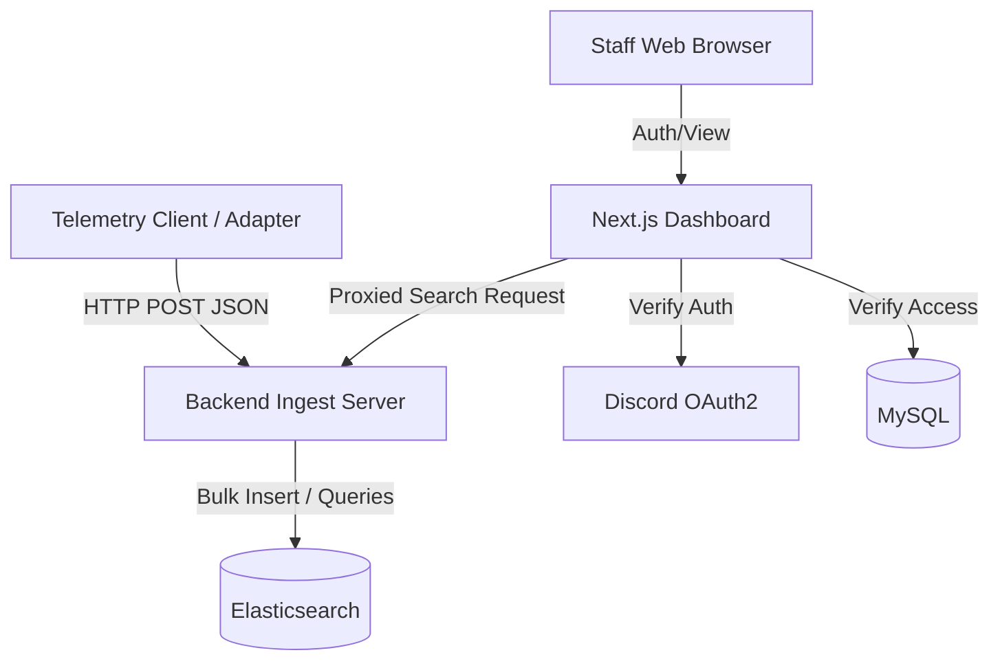

# Architecture Overview

The system relies on a decoupled, event-driven architecture. By isolating the ingest layer from the dashboard proxy, and strictly separating search indexing from relational storage, the system achieves massive throughput stability under heavy load.

---

## High-Level Diagram

---

## Component Breakdown

### 1. Client Emitters & Adapters
Operating within the host application's runtime (e.g., our provided FiveM Lua wrapper, or any custom Node/Python backend), the client layer has one strict responsibility: capture context and flush it as quickly as possible.
- **Non-Blocking:** Utilizes asynchronous HTTP requests to ensure the host application's main thread is never blocked during telemetry transmission.
- **Resilient:** If the ingest backend is unreachable or under extreme load, the emitter layer gracefully swallows payload errors rather than crashing the host application.

### 2. Node.js Ingest Service
The core throughput highway. High-traffic environments generate hundreds of complex events per second, requiring a dedicated pipeline to process and route them.
- **Technology:** Node.js, Express, and `@elastic/elasticsearch`.
- **Purpose:** Exposes standard REST endpoints (`/log`, `/search`, `/stats`) acting as an optimized validation and proxy layer into Elasticsearch.
- **Security Note:** To maximize ingestion speed, the `POST /log` endpoint is designed to be lightweight. It relies on internal network isolation (e.g., firewalling the ingest port to only accept traffic from trusted internal application hosts) rather than heavy, per-request authentication middlewares.

### 3. Dual-Database Paradigm
Attempting to store high-volume, unstructured telemetry in SQL tables leads to severe performance degradation. This architecture utilizes two highly optimized engines strictly for their intended purposes:
- **Elasticsearch (Time-Series / Telemetry):** Handles completely dynamic JSON ingest capabilities. Capable of processing millions of full-text search string matches and complex aggregations in milliseconds.
- **MySQL (Configuration / Relational):** Accessed exclusively by the Dashboard. Handles statically structured state data such as `log_channels` configurations, OAuth `users`, and `user_server_access` mappings. Provides robust relational normalization.

### 4. Next.js Admin Dashboard
The user-facing analytics portal built on modern React paradigms.
- **Framework:** Next.js 14 (Server Components + App Router).
- **Authentication Strategy:** Stateless JWT verification generated locally after establishing identity via Discord OAuth2. There are no server-side sessions stored in memory.
- **Proxy Layer:** The frontend client never touches Elasticsearch directly. Search and aggregation requests from users are authenticated against their MySQL RBAC permissions, and only then are the correctly parameterized queries proxied securely to the Ingest backend.

---

## Security Posture

1. **Access Control:** Tenant isolation is enforced in MySQL by the Next.js dashboard. Authenticated users cannot query or even view log channel definitions for environments they haven't been explicitly assigned to via `user_server_access`.
2. **Internal Network Separation:** Because the Node.js ingest prioritizes raw throughput for incoming logs, public internet access to the backend's port must be closed. Traffic should be explicitly whitelisted to only allow local/VPC connections from your telemetry emitters and the Next.js dashboard instance.
3. **Query Injection Prevention:** The Elasticsearch client strictly utilizes structured JSON Query DSL. User input passed from the web UI is safely parameterized by the backend proxy before it ever hits the database layer.
